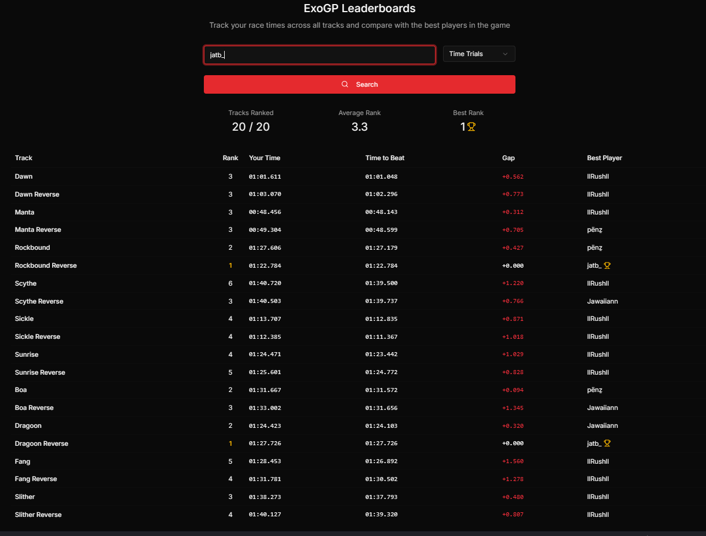

# ExoGP Leaderboards

A dashboard for tracking player performance across all tracks in ExoGP racing game. This application allows players to search for their race times, compare with the best players, and view their rankings across different tracks.



## Features

- Search for player performance by name
- Toggle between Time Trials and Quickplay modes
- View player rankings across all tracks
- Compare player times with the best times
- See average rank and best rank statistics
- Dark mode UI

## Technologies Used

- **Next.js 15** - Latest React framework with App Router
- **React 19** - Latest UI library with improved performance
- **TypeScript** - Type-safe JavaScript
- **Tailwind CSS v4** - Latest utility-first CSS framework
- **shadcn/ui** - Reusable UI components
- **Lucide React** - Icon library
- **Bun** - Fast JavaScript runtime and package manager

## Getting Started

### Prerequisites

- Bun 1.0 or later

### Installation

1. Clone the repository:

```bash
git clone https://github.com/FJabilee/exogp-race-tracker.git
cd exogp-race-tracker
```

2. Install dependencies:


```shellscript
bun install
```

3. Run the development server:


```shellscript
bun run dev 
```

4. Open [http://localhost:3000](http://localhost:3000) in your browser to see the application.


## Usage

1. Enter a player name in the search field
2. Select the game mode (Time Trials or Quickplay)
3. Click the Search button
4. View the player's performance across all tracks
5. The dashboard will display:

1. Number of tracks where the player is ranked
2. Average rank across all tracks
3. Best rank achieved
4. Detailed performance for each track including rank, time, and comparison with the best time


## API Integration

The dashboard integrates with the ExoGP leaderboards API to fetch player data:

```typescript
const url = `https://leaderboards.planetatmos.com/api/leaderboard/tracks/${trackId}?page=0&perPage=20&distinctOnUser=true&mode=${mode}&startDate=${startDate}&endDate=${endDate}&track=${trackId}`
```

## Customization

### Theming

The application uses a custom red theme with HSL color values. You can modify the theme by editing the CSS variables in `app/globals.css`:

```css
:root {
  --primary: hsl(0 72.2% 50.6%);
  --primary-foreground: hsl(0 85.7% 97.3%);
  /* Other color variables */
}
```


## Contributing

Contributions are welcome! Please feel free to submit a Pull Request.

1. Fork the repository
2. Create your feature branch (`git checkout -b feature/amazing-feature`)
3. Commit your changes (`git commit -m 'Add some amazing feature'`)
4. Push to the branch (`git push origin feature/amazing-feature`)
5. Open a Pull Request


## License

This project is licensed under the MIT License - see the LICENSE file for details.

## Acknowledgments

- Planet Atmos for the ExoGP game and leaderboard API
- shadcn/ui for the beautiful UI components
- Coolify for making things easy for me to deploy webapps!